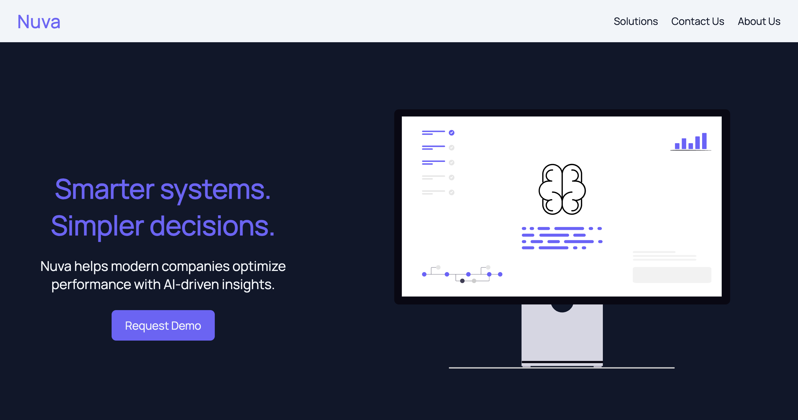

# Landing Page

This is a modern landing page built as part of [The Odin Project - Foundations Course](https://www.theodinproject.com/paths/foundations/courses/foundations). It was developed from scratch using a provided design mockup, focusing on clean HTML structure and modern CSS layout techniques.

## Screenshot

## Live Preview

[View Site Here](https://Mahmoud-Badi.github.io/landing-page)

## Tech Used

- HTML
- CSS
- Git & GitHub

## What Was Built

- Full landing page layout
- Clean HTML
- Modern CSS (Flexbox)
- Clean, consistent design
- Hero, feature, testimonials, and Call-to-action section
- Built from scratch using a provided design reference

## What I Learned

- How to structure a full-page layout with HTML
- Using Flexbox to align and distribute elements
- Linking HTML and CSS for effective web design and layout
- Working with Git and publishing via GitHub Pages

## Future Improvements

- Implement a dark mode toggle to enhance user experience
- Build additional static pages to turn this landing page into a full website

## Credits

- Design provided by The Odin Project
- SVG from from [undraw](https://undraw.co)

---

